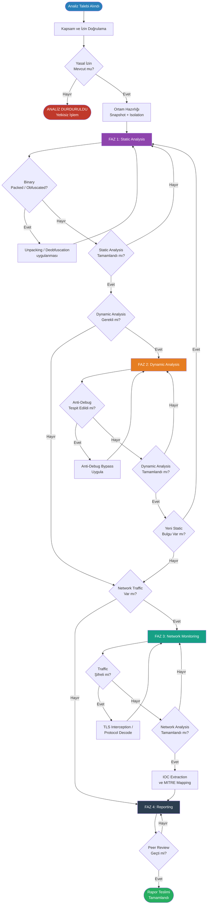
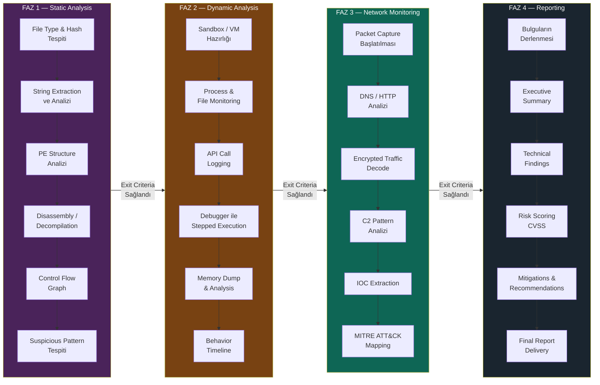

# Reverse Engineering Methodology Documentation

> **Istinye University — Cybersecurity Division**
> Course: BGT210 · Reverse Engineering · Spring 2025-2026
> Instructor: Keyvan Arasteh
> Author: Semih Kaynar (2420****1011)

---

## İçindekiler

1. [Giriş ve Kapsam](#1-giriş-ve-kapsam)
2. [Metodoloji Genel Bakış](#2-metodoloji-genel-bakış)
3. [Faz 1 — Static Analysis](#3-faz-1--static-analysis)
4. [Faz 2 — Dynamic Analysis](#4-faz-2--dynamic-analysis)
5. [Faz 3 — Network Monitoring](#5-faz-3--network-monitoring)
6. [Faz 4 — Reporting](#6-faz-4--reporting)
7. [Karar Akış Diyagramı (Decision Flowchart)](#7-karar-akış-diyagramı-decision-flowchart)
8. [Süreç Akış Diyagramı (Process Flowchart)](#8-süreç-akış-diyagramı-process-flowchart)
9. [Tool Selection Criteria](#9-tool-selection-criteria)
10. [Tool Comparison Matrix](#10-tool-comparison-matrix)
11. [Professional Reporting Template](#11-professional-reporting-template)
12. [Kaynaklar](#12-kaynaklar)

---

## 1. Giriş ve Kapsam

Bu doküman, binary analiz, malware inceleme ve yazılım güvenlik denetimi süreçlerinde kullanılmak üzere hazırlanmış kurumsal düzeyde bir **reverse engineering** metodoloji rehberidir. Amaç; tekrarlanabilir, savunulabilir ve belgelenebilir bir analiz süreci tanımlamaktır.

### 1.1 Hedef Kitle

| Rol | Kullanım Amacı |
|---|---|
| Malware Analyst | Zararlı yazılım davranış analizi |
| Penetration Tester | Hedef binary'nin güvenlik açıklarının tespiti |
| Security Researcher | Protokol ve algoritma tersine mühendisliği |
| Incident Responder | Olay müdahalesinde artifact analizi |

### 1.2 Kapsam Dışı

- Legal izin alınmamış sistemlere yönelik analiz
- Üretim ortamlarında controlled environment dışında dynamic analysis
- Lisanslı yazılımların cracking amacıyla analizi

---

## 2. Metodoloji Genel Bakış

Analiz süreci dört ana fazdan oluşur ve her faz bir sonraki fazın girdisini üretir. Faz geçişleri, tanımlı **exit criteria**'ya dayalı olarak gerçekleştirilir.

```
Static Analysis → Dynamic Analysis → Network Monitoring → Reporting
```

Her faz bağımsız olarak tamamlanabilir; ancak kapsamlı bir analiz için tüm fazların sırayla icra edilmesi zorunludur. Bulgular iteratif olarak bir önceki faza geri beslenir.

---

## 3. Faz 1 — Static Analysis

### 3.1 Tanım

Static analysis, hedef binary veya kaynak kodun **çalıştırılmadan** incelenmesi sürecidir. Bu fazda execution ortamına ihtiyaç duyulmaz; dolayısıyla en güvenli analiz yöntemidir.

### 3.2 Amaçlar

- Binary'nin genel yapısını, mimarisini ve dosya formatını anlamak
- Import/export table, string, metadata ve section analizi yapmak
- Potansiyel zararlı fonksiyon çağrılarını tespit etmek
- Obfuscation veya packing mekanizmalarını belirlemek

### 3.3 Checklist

| # | Kontrol Adımı | Araç | Tamamlandı |
|---|---|---|---|
| 1 | Dosya türü ve magic byte tespiti | `file`, `TrID` | ☐ |
| 2 | Hash hesaplama (MD5, SHA256) ve VirusTotal kontrolü | `md5sum`, `sha256sum`, VT API | ☐ |
| 3 | Packer/Protector tespiti | `PEiD`, `Detect-It-Easy (DiE)` | ☐ |
| 4 | String analizi (plaintext, wide, encoded) | `strings`, `FLOSS` | ☐ |
| 5 | Import table analizi (API call patterns) | `CFF Explorer`, `PE-bear` | ☐ |
| 6 | Export table analizi | `CFF Explorer` | ☐ |
| 7 | Section analizi (entropy, permissions) | `PE-bear`, `pestudio` | ☐ |
| 8 | Disassembly ve control flow graph üretimi | `Ghidra`, `IDA Pro`, `Binary Ninja` | ☐ |
| 9 | Decompilation ve pseudo-code inceleme | `Ghidra`, `IDA Hex-Rays`, `Snowman` | ☐ |
| 10 | Crypto constant ve algorithm tespiti | `findcrypt`, `signsrch` | ☐ |
| 11 | Anti-analysis teknik tespiti (anti-debug, anti-VM) | Manuel + `IDA Pro` scripting | ☐ |
| 12 | Metadata ve EXIF bilgisi inceleme | `ExifTool` | ☐ |
| 13 | Embedded resource analizi | `Resource Hacker`, `binwalk` | ☐ |

### 3.4 Exit Criteria

Static analysis fazından çıkış için aşağıdaki koşulların sağlanması zorunludur:

- [ ] Binary'nin temel davranışı hakkında hipotez oluşturulmuş olmalı
- [ ] Packed/obfuscated ise unpacking stratejisi belirlenmiş olmalı
- [ ] Dynamic analysis için izleme öncelikleri belirlenmiş olmalı

---

## 4. Faz 2 — Dynamic Analysis

### 4.1 Tanım

Dynamic analysis, hedef binary'nin **kontrollü bir ortamda çalıştırılarak** davranışlarının gözlemlenmesi sürecidir. Sandbox, sanal makine veya izole fiziksel sistem üzerinde icra edilir.

> ⚠️ **Güvenlik Uyarısı:** Dynamic analysis her zaman izole edilmiş bir ortamda (sandbox, snapshot alınmış VM) gerçekleştirilmelidir. Host sistem ile network bağlantısı kesilmeli veya kontrollü olmalıdır.

### 4.2 Ortam Gereksinimleri

| Bileşen | Minimum Gereksinim | Önerilen |
|---|---|---|
| Hypervisor | VirtualBox 7.x | VMware Workstation Pro |
| Guest OS | Windows 10 x64 (clean snapshot) | FlareVM üzerinde Windows 11 |
| Network | Host-only veya INetSim | REMnux + INetSim gateway |
| Snapshot | Analiz öncesi temiz snapshot | Otomatik snapshot + rollback scripti |

### 4.3 Checklist

| # | Kontrol Adımı | Araç | Tamamlandı |
|---|---|---|---|
| 1 | Temiz snapshot alınması ve ortam izolasyonu | VMware / VirtualBox | ☐ |
| 2 | Process monitoring kurulumu | `Process Monitor (ProcMon)` | ☐ |
| 3 | File system değişikliklerinin izlenmesi | `ProcMon`, `Noriben` | ☐ |
| 4 | Registry değişikliklerinin izlenmesi | `ProcMon`, `RegShot` | ☐ |
| 5 | Process ve thread takibi | `Process Hacker`, `Process Explorer` | ☐ |
| 6 | API call logging | `API Monitor`, `Frida` | ☐ |
| 7 | Debugger ile kontrollü çalıştırma | `x64dbg`, `WinDbg` | ☐ |
| 8 | Breakpoint stratejisi uygulanması | `x64dbg` | ☐ |
| 9 | Memory dump alma ve analiz | `Process Hacker`, `Volatility` | ☐ |
| 10 | Injected code tespiti | `Process Hacker`, `Hollows Hunter` | ☐ |
| 11 | Persistence mekanizmalarının tespiti | `Autoruns` | ☐ |
| 12 | Anti-debug bypass uygulanması | Manuel patch, `ScyllaHide` plugin | ☐ |
| 13 | Behavior timeline oluşturulması | `CAPE Sandbox`, `Any.run` raporu | ☐ |

### 4.4 Debugger Stratejisi

Debugger kullanımında aşağıdaki adım sırası izlenmelidir:

1. **Entry point** üzerine breakpoint yerleştirilmesi
2. Anti-debug kontrolleri için `IsDebuggerPresent`, `CheckRemoteDebuggerPresent`, `NtQueryInformationProcess` API çağrılarına breakpoint
3. Network API'lara breakpoint: `WSAStartup`, `connect`, `send`, `recv`, `InternetOpenA`
4. File system API'larına breakpoint: `CreateFileA`, `WriteFile`, `DeleteFileA`
5. Registry API'larına breakpoint: `RegSetValueExA`, `RegCreateKeyExA`

### 4.5 Exit Criteria

- [ ] Binary'nin davranışları (dosya, registry, process, network) tam olarak loglanmış olmalı
- [ ] Memory artifacts toplanmış olmalı
- [ ] Tespit edilen C2 adresleri veya network indicator'ları listelenmiş olmalı

---

## 5. Faz 3 — Network Monitoring

### 5.1 Tanım

Network monitoring fazında, hedef binary'nin ürettiği **network traffic** yakalanır, decode edilir ve analiz edilir. Bu faz, C2 communication, data exfiltration, protocol analizi ve domain/IP indicator tespiti için kritiktir.

### 5.2 Ortam Mimarisi

```
[Analysis VM] ──── [Host-Only Network] ──── [REMnux Gateway]
                                                    │
                                            INetSim (fake services)
                                            FakeDNS / FakeHTTP
                                                    │
                                            Wireshark / tcpdump
```

### 5.3 Checklist

| # | Kontrol Adımı | Araç | Tamamlandı |
|---|---|---|---|
| 1 | Network capture başlatılması | `Wireshark`, `tcpdump` | ☐ |
| 2 | DNS query'lerinin loglanması | `FakeDNS`, `INetSim`, `Wireshark` | ☐ |
| 3 | HTTP/HTTPS traffic analizi | `Wireshark`, `mitmproxy`, `Burp Suite` | ☐ |
| 4 | TLS/SSL certificate inceleme | `Wireshark`, `openssl` | ☐ |
| 5 | Encrypted traffic pattern analizi | `Wireshark`, `NetworkMiner` | ☐ |
| 6 | Custom protocol ve unknown port analizi | `Wireshark` dissector, `ngrep` | ☐ |
| 7 | Packet payload decode (base64, XOR, custom) | `CyberChef` | ☐ |
| 8 | C2 communication pattern tespiti | Manuel + `Zeek` | ☐ |
| 9 | Beaconing interval analizi | `Rita`, `Zeek` | ☐ |
| 10 | Data exfiltration indicator tespiti | `Wireshark`, `NetworkMiner` | ☐ |
| 11 | IOC extraction (IP, domain, URL, hash) | `IOC Extractor`, `MISP` | ☐ |
| 12 | PCAP dosyasının arşivlenmesi | `Wireshark export` | ☐ |

### 5.4 Packet Sniffing Protokolü

Capture başlatılmadan önce:

1. INetSim veya FakeDNS servisleri aktif edilmeli
2. Capture interface doğrulanmalı (host-only adapter)
3. PCAP dosyası için yeterli disk alanı kontrolü yapılmalı
4. Timestamp senkronizasyonu sağlanmalı

### 5.5 Exit Criteria

- [ ] Tüm network traffic PCAP formatında arşivlenmiş olmalı
- [ ] IOC'ler (Indicator of Compromise) listelenmiş ve MITRE ATT&CK'a eşlenmiş olmalı
- [ ] C2 adresi veya exfiltration endpoint'i belirlenmiş olmalı (tespit edilemiyorsa belgelenmiş olmalı)

---

## 6. Faz 4 — Reporting

### 6.1 Tanım

Reporting fazı, önceki üç fazdan elde edilen tüm bulguların sentezlendiği, yapılandırıldığı ve hedef kitleye sunulduğu aşamadır. Rapor, teknik detay ile yönetici özeti arasındaki dengeyi korumalıdır.

### 6.2 Checklist

| # | Kontrol Adımı | Tamamlandı |
|---|---|---|
| 1 | Executive Summary yazılması | ☐ |
| 2 | Technical Summary yazılması | ☐ |
| 3 | Her faz için bulguların derlenmesi | ☐ |
| 4 | IOC listesinin hazırlanması | ☐ |
| 5 | MITRE ATT&CK mapping tamamlanması | ☐ |
| 6 | Risk skorlaması yapılması (CVSS / custom) | ☐ |
| 7 | Öneri ve mitigation adımlarının yazılması | ☐ |
| 8 | Artifacts ve evidence'ların eklenmesi | ☐ |
| 9 | Raporun peer review sürecine sokulması | ☐ |
| 10 | Final versiyonun imzalanması ve teslimi | ☐ |

---

## 7. Karar Akış Diyagramı (Decision Flowchart)

Aşağıdaki flowchart, hangi koşulda hangi faza geçileceğini ve iteratif geri besleme döngülerini göstermektedir.



---

## 8. Süreç Akış Diyagramı (Process Flowchart)

Aşağıdaki diyagram, her fazın iç adımlarını ve faz geçiş noktalarını göstermektedir.



---

## 9. Tool Selection Criteria

Araç seçimi aşağıdaki kriterlere göre yapılmalıdır. Her kriter 1–5 arasında puanlanır ve toplam ağırlıklı skor hesaplanır.

| Kriter | Ağırlık | Açıklama |
|---|---|---|
| **Accuracy** | 30% | Doğru analiz sonucu üretme kapasitesi |
| **Automation** | 20% | Tekrarlanan görevlerin otomatikleştirilebilirliği |
| **Scriptability** | 20% | API / plugin / script desteği |
| **Community Support** | 15% | Aktif geliştirme ve dokümantasyon kalitesi |
| **License Cost** | 15% | Ticari lisans gereksinimi (düşük maliyet = yüksek skor) |

### 9.1 Minimum Kabul Kriterleri

Bir araç aşağıdaki eşikleri sağlamıyorsa kullanılmamalıdır:

- Accuracy skoru ≥ 3/5
- Son 12 ay içinde aktif güncelleme almış olması
- Platform desteği: analiz ortamı ile uyumlu (Windows / Linux)

---

## 10. Tool Comparison Matrix

### 10.1 Disassembler / Decompiler Karşılaştırması

| Araç | Lisans | Platform | Scripting | Decompiler | Collaboration | Skor |
|---|---|---|---|---|---|---|
| **IDA Pro** | Ticari | Win/Lin/Mac | IDAPython, IDC | Hex-Rays (ek ücret) | Team server | ⭐⭐⭐⭐⭐ |
| **Ghidra** | Ücretsiz (NSA) | Win/Lin/Mac | Java, Python | Dahili | Git entegrasyonu | ⭐⭐⭐⭐½ |
| **Binary Ninja** | Ticari/Community | Win/Lin/Mac | Python API | Dahili (MLIL) | Cloud collab | ⭐⭐⭐⭐ |
| **Cutter (Rizin)** | Ücretsiz | Win/Lin/Mac | Python, r2pipe | Dahili (r2dec) | Sınırlı | ⭐⭐⭐ |
| **RetDec** | Ücretsiz | Win/Lin | Sınırlı | Dahili | Yok | ⭐⭐½ |

### 10.2 Debugger Karşılaştırması

| Araç | Platform | Anti-Debug Bypass | Script | Kernel Debug | Skor |
|---|---|---|---|---|---|
| **x64dbg** | Windows | ScyllaHide plugin | x64dbg script, Python | Hayır | ⭐⭐⭐⭐⭐ |
| **WinDbg (Preview)** | Windows | Sınırlı | WinDbg script, JS | Evet | ⭐⭐⭐⭐½ |
| **GDB + pwndbg** | Linux/Mac | Sınırlı | Python (GEF/pwndbg) | Evet (kgdb) | ⭐⭐⭐⭐ |
| **OllyDbg** | Windows | Manual | OllyScript | Hayır | ⭐⭐ (legacy) |
| **Frida** | Cross-platform | Native | JavaScript | Hayır | ⭐⭐⭐⭐ |

### 10.3 Network Analysis Karşılaştırması

| Araç | Kullanım Amacı | Protocol Support | Filtreleme | Decode | Skor |
|---|---|---|---|---|---|
| **Wireshark** | Full packet capture | 1000+ | BPF + display filter | Otomatik | ⭐⭐⭐⭐⭐ |
| **mitmproxy** | HTTP/HTTPS MITM | HTTP, HTTPS, WebSocket | Python script | SSL strip | ⭐⭐⭐⭐ |
| **Zeek (Bro)** | Traffic analizi / SIEM | Geniş | Script | Log bazlı | ⭐⭐⭐⭐ |
| **NetworkMiner** | Forensic extraction | HTTP, FTP, SMB | Sınırlı | File carving | ⭐⭐⭐½ |
| **ngrep** | Pattern matching | TCP/UDP | Regex | Yok | ⭐⭐⭐ |
| **Burp Suite** | Web proxy | HTTP/HTTPS | Kural bazlı | Evet | ⭐⭐⭐⭐ |

### 10.4 Sandbox / Automated Analysis

| Platform | Deployment | OS Desteği | API | Ücretsiz Tier | Skor |
|---|---|---|---|---|---|
| **CAPE Sandbox** | Self-hosted | Windows, Linux | REST API | Evet | ⭐⭐⭐⭐⭐ |
| **Any.run** | Cloud | Windows | REST API | Evet (sınırlı) | ⭐⭐⭐⭐ |
| **Cuckoo 3** | Self-hosted | Windows, Linux, Android | REST API | Evet | ⭐⭐⭐⭐ |
| **Joe Sandbox** | Cloud/On-prem | Windows, Linux, Mac | REST API | Hayır | ⭐⭐⭐⭐½ |

---

## 11. Professional Reporting Template

Aşağıdaki şablon, her reverse engineering analizi sonunda üretilmesi gereken raporun yapısını tanımlamaktadır.

---

### RAPOR ŞABLONU

```
╔══════════════════════════════════════════════════════════════╗
║         REVERSE ENGINEERING ANALYSIS REPORT                  ║
║         [Organization Name] — Confidential                   ║
╠══════════════════════════════════════════════════════════════╣
║  Report ID    : RE-YYYY-NNNN                                 ║
║  Date         : YYYY-MM-DD                                   ║
║  Analyst      : [Full Name], [Certification]                 ║
║  Reviewed By  : [Reviewer Name]                              ║
║  TLP          : TLP:RED / TLP:AMBER / TLP:GREEN              ║
╚══════════════════════════════════════════════════════════════╝
```

---

#### 11.1 Executive Summary

| Alan | İçerik |
|---|---|
| **Analiz Konusu** | Örn: `invoice_q4.exe` — şüpheli email attachment |
| **Tehdit Seviyesi** | CRITICAL / HIGH / MEDIUM / LOW |
| **Tespit Edilen Tehdit** | Örn: Ransomware, RAT, Spyware, Backdoor |
| **Özet Bulgu** | 3–5 cümle ile non-teknik özet |
| **Acil Aksiyon** | Örn: C2 IP'lerin tüm güvenlik duvarlarında bloğu |

---

#### 11.2 Sample Metadata

| Özellik | Değer |
|---|---|
| **Dosya Adı** | `[filename]` |
| **MD5** | `[hash]` |
| **SHA256** | `[hash]` |
| **Dosya Boyutu** | `[bytes]` |
| **Dosya Türü** | `[PE32+, ELF64, APK, ...]` |
| **Mimari** | `[x86, x86-64, ARM64, ...]` |
| **Derleme Tarihi** | `[timestamp veya "stripped"]` |
| **Packer** | `[tespit edilen packer veya "none"]` |
| **VirusTotal Skoru** | `[X/72]` |

---

#### 11.3 Static Analysis Findings

**11.3.1 Suspicious Strings**

```
[Tespit edilen şüpheli string'lerin listesi]
Örn:
  - cmd.exe /c
  - powershell -enc
  - https://[redacted].onion/gate.php
  - SOFTWARE\Microsoft\Windows\CurrentVersion\Run
```

**11.3.2 Suspicious Imports**

| API | Modül | Amaç (Tahmini) |
|---|---|---|
| `VirtualAlloc` | kernel32.dll | Shellcode için bellek tahsisi |
| `WriteProcessMemory` | kernel32.dll | Process injection |
| `CreateRemoteThread` | kernel32.dll | Remote thread oluşturma |
| `CryptEncrypt` | advapi32.dll | Veri şifreleme |

**11.3.3 Obfuscation / Anti-Analysis**

- [ ] Packing tespit edildi: `[packer adı]`
- [ ] String obfuscation: `[yöntem]`
- [ ] Anti-debug teknik: `[teknik]`
- [ ] Anti-VM kontrol: `[teknik]`
- [ ] Timing-based evasion: `[açıklama]`

---

#### 11.4 Dynamic Analysis Findings

**11.4.1 Process Activity**

| Eylem | Süreç | Parametre |
|---|---|---|
| Process Created | `cmd.exe` | `/c whoami` |
| Process Injected | `explorer.exe` | DLL injection |

**11.4.2 File System Activity**

| Eylem | Yol | Açıklama |
|---|---|---|
| Created | `%APPDATA%\[filename]` | Persistence dropper |
| Deleted | `%TEMP%\[filename]` | Self-cleanup |
| Encrypted | `%USERPROFILE%\Documents\*` | Ransomware behavior |

**11.4.3 Registry Activity**

| Eylem | Key | Value | Data |
|---|---|---|---|
| Set | `HKCU\...\Run` | `Updater` | `C:\...\malware.exe` |

**11.4.4 Persistence Mechanisms**

- [ ] Registry Run key
- [ ] Scheduled Task
- [ ] Service installation
- [ ] DLL hijacking
- [ ] Startup folder

---

#### 11.5 Network Analysis Findings

**11.5.1 DNS Queries**

| Domain | Query Type | Yanıt |
|---|---|---|
| `[redacted].ru` | A | `[IP]` |
| `[redacted].onion` | — | DNS over Tor |

**11.5.2 C2 Communication**

| Protokol | Hedef IP | Port | Interval | Amaç |
|---|---|---|---|---|
| HTTPS | `[IP]` | 443 | 60 saniye | Beaconing |
| Custom TCP | `[IP]` | 8443 | Event-driven | Command execution |

**11.5.3 Data Exfiltration Indicators**

| Metod | Hedef | Veri Türü | Boyut |
|---|---|---|---|
| HTTP POST | `[URL]` | System info (JSON) | ~2 KB |
| DNS TXT | `[domain]` | Encoded credentials | ~500 B |

---

#### 11.6 MITRE ATT&CK Mapping

| Tactic | Technique ID | Technique Name | Kanıt |
|---|---|---|---|
| Execution | T1059.001 | PowerShell | `powershell -enc ...` string |
| Persistence | T1547.001 | Registry Run Keys | HKCU\...\Run modification |
| Defense Evasion | T1055.001 | Process Injection | `WriteProcessMemory` API call |
| Discovery | T1082 | System Information Discovery | `GetSystemInfo` API + WMI |
| C2 | T1071.001 | Web Protocols | HTTPS beacon traffic |
| Exfiltration | T1041 | Exfiltration Over C2 | POST request with encoded data |

---

#### 11.7 IOC (Indicator of Compromise) Listesi

```yaml
hashes:
  md5:    "[hash]"
  sha256: "[hash]"

network:
  ip_addresses:
    - "[IP1]"
    - "[IP2]"
  domains:
    - "[domain1]"
    - "[domain2]"
  urls:
    - "https://[redacted]/gate.php"

files:
  - path: "%APPDATA%\\[filename]"
    description: "Dropped persistence binary"
  - path: "%TEMP%\\[filename]"
    description: "Temporary loader"

registry:
  - key: "HKCU\\Software\\Microsoft\\Windows\\CurrentVersion\\Run"
    value: "[value name]"
```

---

#### 11.8 Risk Değerlendirmesi

| Faktör | Değer | Gerekçe |
|---|---|---|
| **Confidentiality Impact** | HIGH | Credential exfiltration tespit edildi |
| **Integrity Impact** | HIGH | Dosya şifreleme / modifikasyon |
| **Availability Impact** | HIGH | Ransomware davranışı |
| **CVSS v3.1 Base Score** | **9.8 CRITICAL** | AV:N/AC:L/PR:N/UI:N/S:C/C:H/I:H/A:H |

---

#### 11.9 Mitigations & Recommendations

| Öncelik | Öneri | Uygulama Süresi |
|---|---|---|
| **CRITICAL** | IOC listesindeki tüm IP ve domain'lerin firewall ve DNS sink'e eklenmesi | Derhal |
| **HIGH** | Etkilenen endpoint'lerin ağdan izole edilmesi ve forensic image alınması | 24 saat |
| **HIGH** | EDR kurallarına MITRE tekniklerinin eklenmesi (T1059, T1055) | 48 saat |
| **MEDIUM** | PowerShell execution policy kısıtlaması ve Script Block Logging aktifleştirilmesi | 1 hafta |
| **MEDIUM** | Kullanıcı farkındalık eğitimi (phishing email vektörü) | 2 hafta |
| **LOW** | Application whitelisting politikasının gözden geçirilmesi | 1 ay |

---

#### 11.10 Analyst Notes & Evidence

```
[Analistin ek notları, önemli gözlemler, sınırlılıklar]

Sınırlılıklar:
- Binary'nin ikinci aşama payload'u network erişimi gerektirdiğinden
  sandbox ortamında tam olarak tetiklenemedi.
- Şifreli C2 kanalının anahtarı memory'den extract edilemedi;
  şifreli trafik içeriği çözülemedi.

Artifacts:
- [filename].pcap  — Full packet capture
- [filename].dmp   — Process memory dump
- [filename]_procmon.pml — ProcMon log
```

---

#### 11.11 İmzalar ve Onay

| Rol | Ad Soyad | İmza | Tarih |
|---|---|---|---|
| Lead Analyst | | | |
| Reviewer | | | |
| Team Lead Approval | | | |

> **Gizlilik Notu:** Bu rapor, TLP:AMBER sınıflandırmasına tabidir. İlgili ekipler dışında paylaşılamaz. Fiziksel veya dijital kopyalar güvenli kanallar üzerinden iletilmelidir.

---

## 12. Kaynaklar

| # | Kaynak | Tür |
|---|---|---|
| 1 | Sikorski, M. & Honig, A. — *Practical Malware Analysis* (No Starch Press) | Kitap |
| 2 | Eagle, C. — *The IDA Pro Book* (No Starch Press) | Kitap |
| 3 | MITRE ATT&CK Framework — https://attack.mitre.org | Framework |
| 4 | NIST SP 800-86 — *Guide to Integrating Forensic Techniques into IR* | Standart |
| 5 | Ghidra Documentation — https://ghidra-sre.org | Tool Docs |
| 6 | x64dbg Documentation — https://help.x64dbg.com | Tool Docs |
| 7 | Wireshark User's Guide — https://www.wireshark.org/docs | Tool Docs |
| 8 | CAPE Sandbox — https://capesandbox.com/docs | Tool Docs |
| 9 | OpenIOC Specification — https://openioc.org | Standard |
| 10 | FIRST CVSS v3.1 Specification — https://www.first.org/cvss | Standard |

---

*Bu doküman Istinye University BGT210 — Reverse Engineering dersi kapsamında akademik amaçlarla hazırlanmıştır.*
*Son Güncelleme: 2026-06-10 | Versiyon: 1.0.0*
